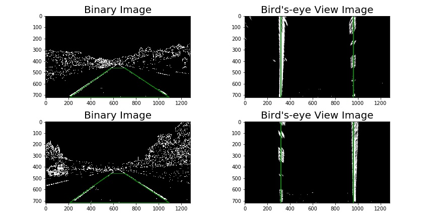

# **Advanced Lane Lines** 

**The goal of this project is to find and highlight the lane in which the car is traveling.  An estimate of the lane curvature and vehicle position will also be shown.**

#### The following steps were taken to accomplish this task.
* Calibrate the camera to obtain the calibration matrix and distortions coefficients that will be used to remove image distortions.  
* Create a pipeline that processes each image as follows:
    1. Correct the image for lens distortions.
    2. Create an edges image where the edges are identified using color information and the Sobel filter.
    3. Transform the edge image into a birds-eye view image.
    4. Detect the lane lines and fit quadratic functions to them.  Calculate the lane curvature and vehicle position relative to the center.
    5. Transform the lane image from the birds-eye view perspective to the perspective of the undistorted image.  Overlay the lane image onto the undistorted image and display the average lane curvature and distance from center.   
* Process videos using the pipeline.

The python code for accomplishing this project is included in the accompanying jupyter notebook.  A number of the functions in the jupyter notebook were taken or motivated from the class section on Advanced Techniques for Lane Finding.  

### Calibration of the Camera

Lens distortions can be removed by calibrating the camera. From the pin-hole camera model, it is known how to map a chessboard in the x,y plane into 3-dimensional space. To find lens distortions, it is a typical procedure to take a number of images of chessboards, detect the corners in the chess board grid and then compare those values with the theoretical values.  

For this project, I was given several chessboard images taken from the camera that took the videos.  A function calibrate_camera() was written to process these images, and returns points for calibration.  For each image, it defines a grid of object points (in the x,y plane) and then uses opencv function findChessboardCorners() to identify the corresponding corners (image points) in the chessboard.  The function processes all of the images and returns lists of the object points and the corresponding image points.

To remove lens distortions from an image, the function undistort_image() was written.  This function takes the object points (obj_points) and image points (img_points) and calls the opencv function calibrateCamera() to calculate the camera matrix and distortion coefficients.  It then calls the opencv function undistort() which uses the matrix and coefficients to correct the image for lens distortions.  An undistorted image is then returned.

Below is an example for one of the chessboard images where the distorted image, the chessboard corners in the distorted image, and then the undistorted image is show.

### The pipeline.
To process each image in the video, a pipeline was used.  The main function for this pipeline is called draw_lane_on_road().  The steps in the pipeline are described below. 

#### 1. Correct the image for lens distortions.
As described above, the function undistort_image() was written to correct an image for lens distortions.  Its does this by using calibration points and opencv functions.  An example of a processed image is shown below. 

#### 2. Create an edges image where the edges are identified using color information and the Sobel filter.
The function get_binary_image() is called to create an edges image from the undistorted image.  The function converts the undistorted image from RGB (Red, Green, Blue) colors to HLS (Hue, Lightness, Saturation) colors.  The saturation channel is used since lane lines tend to show up well in this spectrum.  A Sobel filter that detects edges is applied to the lightness channel.  The Sobel filter is used since it is able to detect edges well.  The final edges image is a binary image where a pixel value of 1 represents high saturation or low normalized Sobel values in the undistorted image.

While this approach did well on the project video images, it performed poorly on the challenge video images.  This was improved by first applying a red color mask to the undistorted image, and then processing the image as described above.  An example of the undistorted image and the resulting edges image is shown below.

#### 3. Transform the edge image into a birds-eye view image.
To better identify the lanes and extract information from them, the edge image is transformed from the front perspective into the birds-eye view perspective.  The function get_bev_image() was written to make this transformation. 

To make this transformation, 2 images with straight lanes were investigated.  A trapezoid containing the region of road of interest was defined in the front perspective and then mapped into a rectangle in the birds-eye view perspective.  The mapping was done so that the lane lines would show up as parallel lines after the transformation.  From the birds-eye view, the pixels can be associated with a unit of length.  From the class notes and based on US regulations,  one pixel in the horizontal direction is approximately 3.7/640 meters and one pixel in the vertical direction is approximately 30/720 meters long. 

The source points (trapezoid corners) and destination points (rectangle corners) are show in the following table.

| Source   | Destination | 
|:--------:|:-----------:| 
| 214, 719 | 319, 719 | 
| 581, 459 | 319,   0 |
| 701, 459 | 959,   0 |
|1094, 719 | 959, 719 |

This get_bev_image() function defines these points and then calls the
opencv functions getPerspectiveTransform() and warpPerspective() to make the transformation.  The two straight lanes edge images from the front and from the birds-eye view perspective are shown below. 

#### 4. Detect the lane lines and fit quadratic functions to them.  Calculate the lane curvature and vehicle position relative to the center.
The function get_lane_fits() was written to accomplish these tasks.  The lane line is represented by a quadratic function of the form $v(h) = c_0 + c_1 h^2 + c_2 h^2$, where v is the vertical position and h is the horizontal position in the image.  The coefficients for these lines are estimated using a weighted least square fit of the lane pixel candidates from the edge image.  To find the pixel candidates, two different algorithms are used.

The first algorithm is used if a fit has not been performed on a previous image.  This algorithm calls the function find_window_centroids() which first looks at the bottom 1/4 of the image (the area closest to the car) on left side.  It adds the binary pixel values in the vertical columns and then finds the left peak or left starting point.  The first rectangle is now defined where this starting point is the center of the bottom edge.  Within this rectangle, the pixels in the vertical columns are summed and the peak of this box is found.  This peak is now used as the center of the bottom edge of the next rectangle.  This is done iteratively from the bottom to the top of the left side of the image.  Any pixels within the left boxes are used to fit the left lane line.  This procedure is repeated on the right side.  An example of these boxes are show below in the center image in dark green. 

The second algorithm is used if the lane lines in the previous image have been fitted.  This algorithm simply defines a region on either side of the previous fit lines.  Any edge pixels within this region are then used for the current fit.  An example of the pixels found by this algorithm are shown below.  To make the fits more stable, points along the previous lane line fit are added to these candidate pixels.  

Once the candidate pixels are found for the left lane, a weight least square fit is used to estimate the coefficients.  The weights for this fit are based on vertical distance and are 1 up to the middle of the image after which they decay linearly to 0 at the top of the image.  This is done because there is more confidence in identifying lanes that are closer than those farther away.  The fit is also checked by making sure the lane crosses the bottom of the image on its correct side.  Examples of these fitted lines are show in green and overlay the left red lane pixel candidates and the right blue lane pixel candidates in the two examples show above. 

To calculate the radius of curvature, the pixel values are converted into distance units and the fits are rerun.  The radius of curvature is found using the following formula:  
$R_{curve} = \frac{1 + (2 c_0 h_{bottom} + c_1)^2}{|2c_0|} $,  
where $c_i$ are the coefficients of the quadratic function, and $h_{bottom}$ is the horizontal length of the image. 

The center of the lane is the average of the positions where the right and left lane lines cross the bottom of the image.  The distance from center is found by comparing the center of the image with the center of the lane.

#### 5. Transform the lane image from the birds-eye view perspective to the perspective of the undistorted image.  Overlay the lane image onto the undistorted image and display the average lane curvature and distance from center.

The birds-eye view lane image is then transformed back from the birds-eye view perspective to the original perspective using the opencv functions getPerspectiveTransform() and warpPerspective().  It is then combined with the initial undistorted image from #1 above using the opencv function addWeighted().  The average radius of curvature and distance from center is then displayed on the combined image using the opencv function putText().  An example of the start and the end of this pipeline is shown below

### Videos
Two videos were processed using this pipeline and are shown in the accompanying jupyter notebook.  They can also be found in the writeup_videos directory.

### Potential issues.
* This pipeline has issues with very bright and very dark road images.  It finds the lanes difficult to detect under these conditions.
* This pipeline also can have issues when a bright object like a white car is near one of the lane lines.  These bright objects often add many candidate pixels to the fits, and the fitted lines tend to pass near or through these objects.

### Possible improvements
* To create the initial binary edge image under many different conditions is quite an art.  Existing literature, filters, and more color spaces should be explored.
* Improving the fitting algorithms should also be explored.  Using more than just the last image, and pooling the pixels should be considered.

